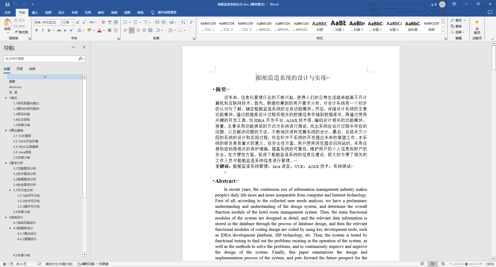
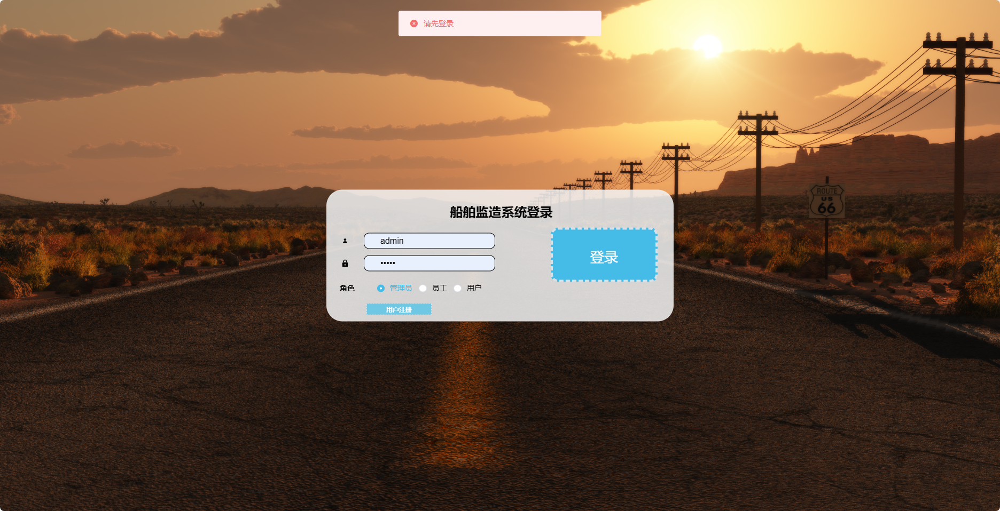
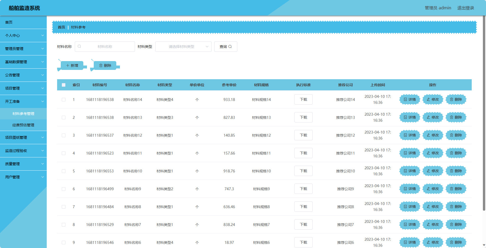
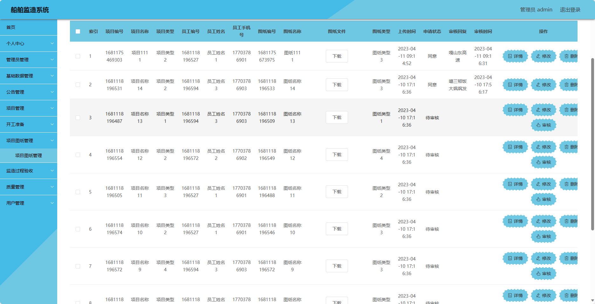
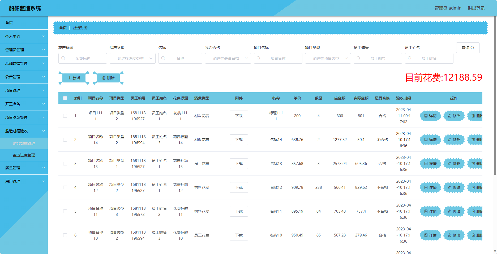
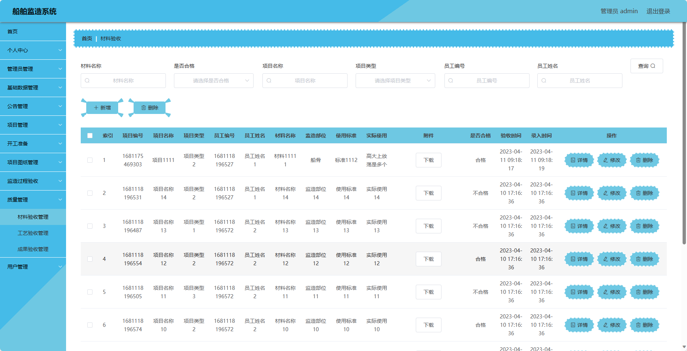
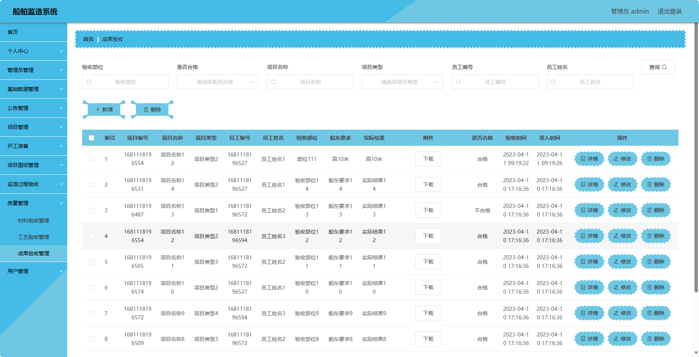
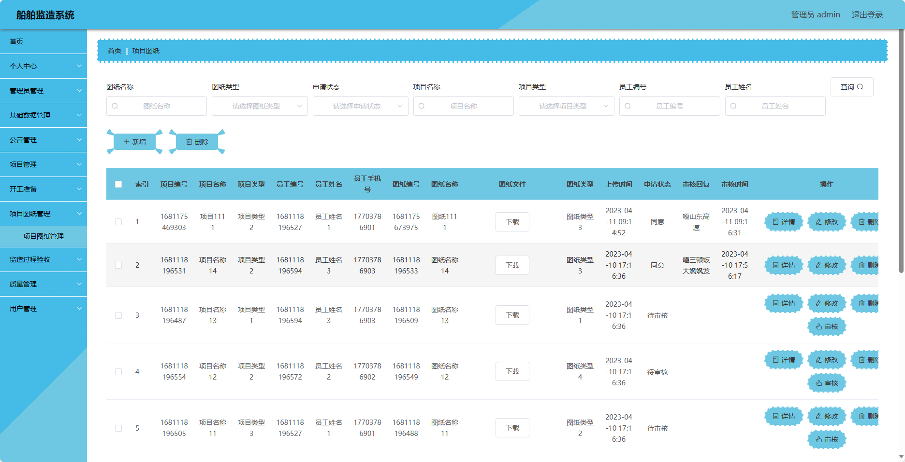
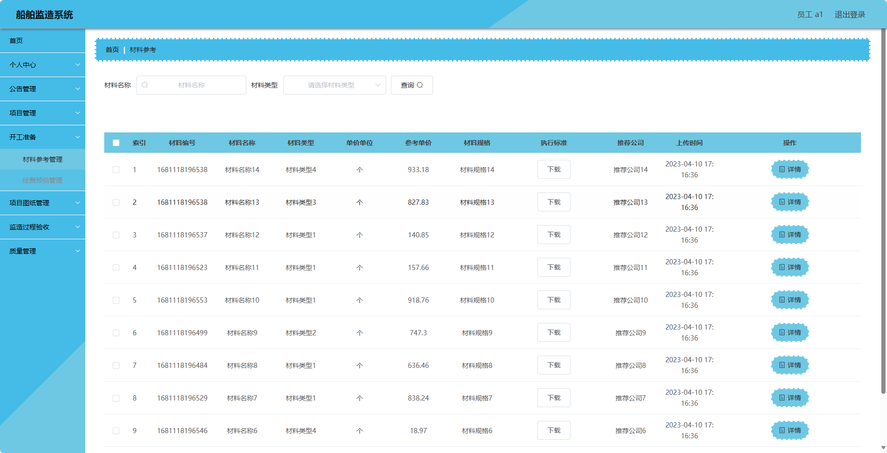
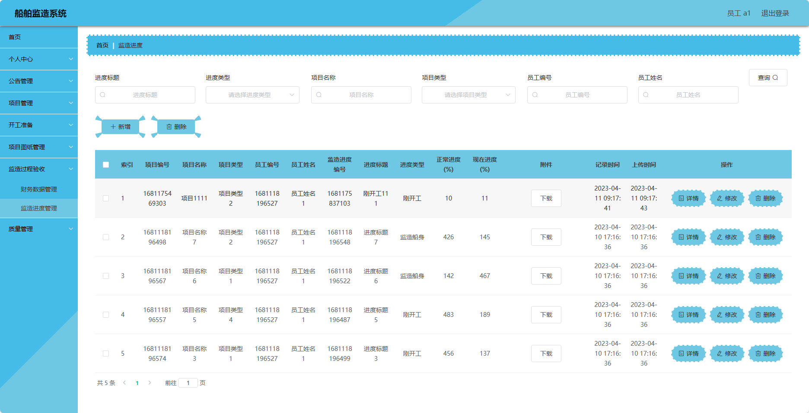

## 基于SpringBoot的船舶监造系统(程序+报告)

- <b>完整代码获取地址：从戎源码网 ([https://armycodes.com/](https://armycodes.com/))</b>
- <b>技术探讨、资料分享，请加QQ群：692619798</b> 
- <b>作者微信：19941326836  QQ：952045282</b> 
- <b>承接计算机毕业设计、Java毕业设计、Python毕业设计、深度学习、机器学习</b>
- <b>选题+开题报告+任务书+程序定制+安装调试+论文+答辩ppt 一条龙服务</b>
- <b>所有选题地址 ([https://github.com/YuLin-Coder/AllProjectCatalog](https://github.com/YuLin-Coder/AllProjectCatalog)) </b>

## 项目介绍
基于SpringBoot的船舶监造系统，系统包含三种角色：管理员、员工、用户,系统分为前台和后台两大模块，主要功能如下。

### 【管理员】:
1. 个人中心：管理员可以管理个人信息，包括修改密码、查看个人信息等。
2. 管理员管理：管理员可以管理其他管理员账号，包括添加、删除、编辑管理员账号等操作。
3. 基础数据管理：管理员可以管理系统的基础数据。
4. 公告管理：管理员可以管理系统发布的公告信息，包括添加、删除、编辑等操作。
5. 项目管理：管理员可以管理船舶监造项目。
6. 开工准备：管理员可以管理船舶监造项目的开工准备情况。
7. 项目图纸管理：管理员可以管理项目相关的图纸文件。
8. 监造过程验收：管理员可以进行监造过程的验收。
9. 质量管理：管理员可以进行质量检查和管理，包括记录问题、制定改进计划等。
10. 用户管理：管理员可以管理普通用户账号，包括查看用户列表、禁用用户等操作。

### 【用户】:
1. 个人中心：用户可以管理个人信息，包括修改密码、查看个人信息等。
2. 公告管理：用户可以查看系统发布的公告信息。
3. 项目管理：用户可以查看自己参与的船舶监造项目。

### 【员工】:
1. 个人中心：员工可以管理个人信息，包括修改密码、查看个人信息等。
2. 公告管理：员工可以查看系统发布的公告信息。
3. 项目管理：员工可以查看被分配的船舶监造项目。
4. 开工准备：员工可以参与船舶监造项目的开工准备工作。
5. 项目图纸管理：员工可以查看和下载项目相关的图纸文件。
6. 监造过程验收：员工可以参与监造过程的验收工作。
7. 质量管理：员工可以记录发现的质量问题，并参与改进计划的执行。

## 项目技术
- 编程语言：Java
- 数据库：MySQL
- 项目管理工具：Maven
- 前端技术：HTML、CSS、JavaScript、Jquery、Vue
- 后端技术：Spring、SpringMVC、MyBatis

## 运行环境
- JDK版本：JDK1.8及以上
- 开发工具：IDEA、Ecplise、Myecplise都可以
- 数据库: MySQL5.7及以上
- Maven：maven3.0及以上
- Node：14.14.0及以上

## 运行截图

